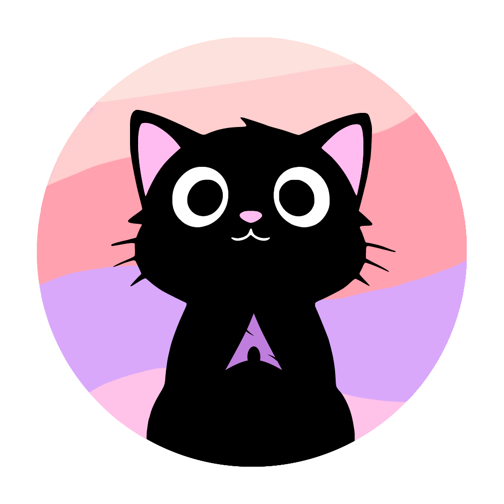
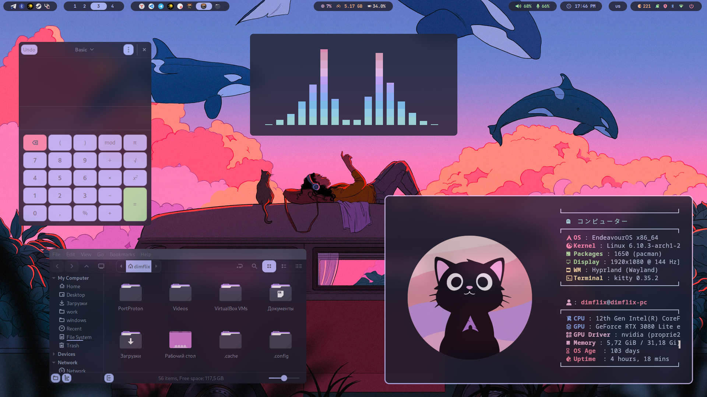
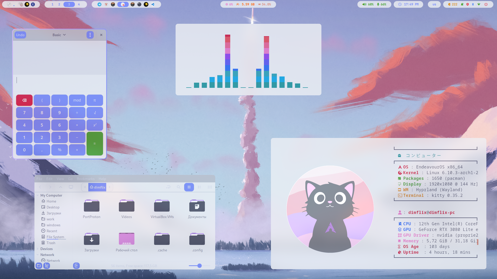
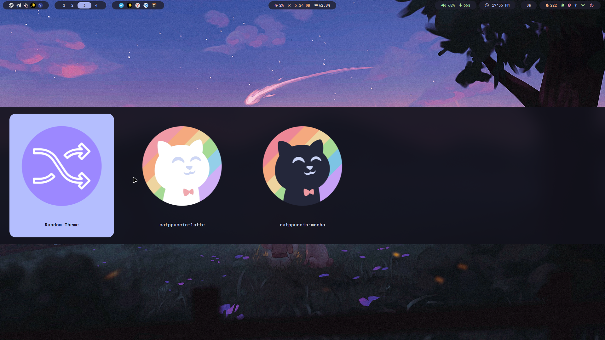
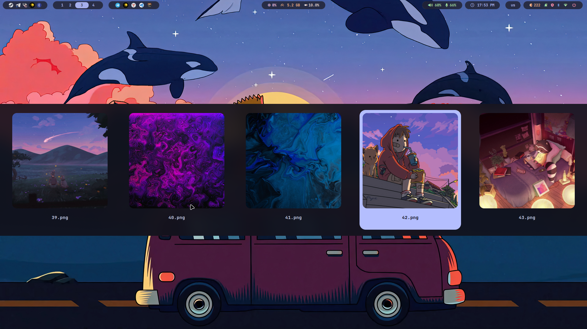
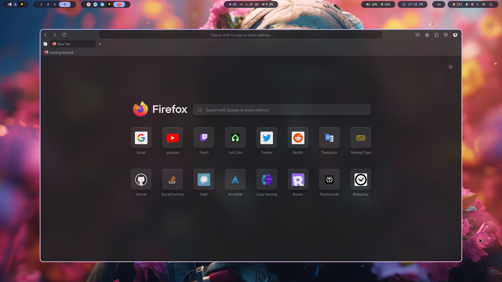
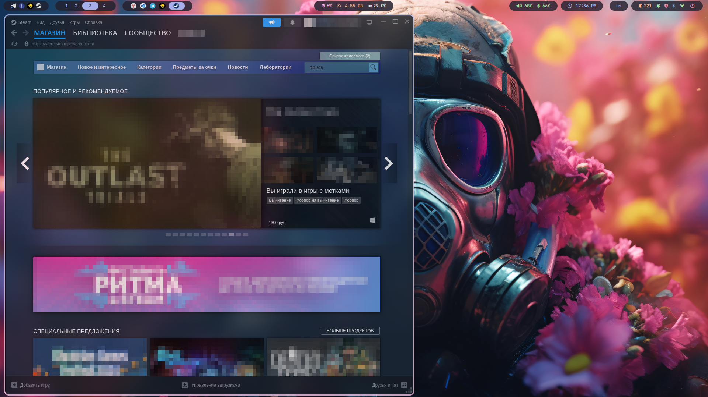
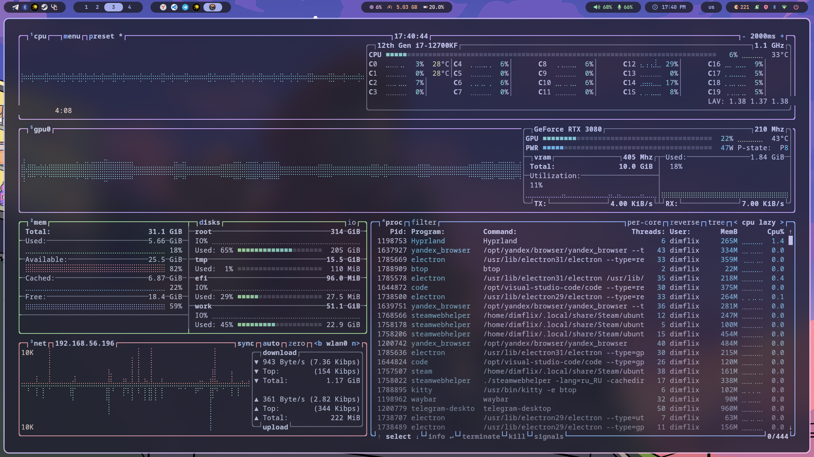

<div align="center">
	
	<h1> Meowrch NixOS ≽ܫ≼</h1>
	<a href="https://github.com/Redm00us/meowrch-nixos/issues">
		
	</a>
	<a href="https://github.com/Redm00us/meowrch-nixos/stargazers">
		
	</a>
	<a href="./LICENSE">
		
	</a>
	<br>
	<br>
	<a href="./README.md">
		
	</a>
	<a href="./README.en.md">
		
	</a>
	<br>
	<br>
	<a href="./ALIASES.md">
		
	</a>
</div>

***

<!-- INFORMATION -->
<table align="right">
	<tr>
	    <td colspan="2" align="center">Системные параметры</td>
	</tr>
	<tr>
	    <th>Компонент</th>
	    <th>Название</th>
	</tr>
	<tr>
	    <td>OS</td>
	    <td><a href="https://nixos.org/">NixOS 25.05</a></td>
	</tr>
	<tr>
	    <td>WM</td>
	    <td><a href="https://hyprland.org/">Hyprland</a></td>
	</tr>
	<tr>
	    <td>Bar</td>
	    <td><a href="https://github.com/Alexays/Waybar">Waybar</a></td>
	</tr>
	<tr>
	    <td>Compositor</td>
	    <td>Built-in</td>
	</tr>
	<tr>
	    <td>Bootloader</td>
	    <td><a href="https://www.freedesktop.org/wiki/Software/systemd/systemd-boot/">systemd-boot</a></td>
	</tr>
	<tr>
	    <td>Terminal</td>
	    <td><a href="https://github.com/kovidgoyal/kitty">Kitty</a></td>
	</tr>
	<tr>
	    <td>App Launcher</td>
	    <td><a href="https://github.com/davatorium/rofi">Rofi</a></td>
	</tr>
	<tr>
	    <td>Notify Daemon</td>
	    <td><a href="https://github.com/dunst-project/dunst">Dunst</a></td>
	</tr>
	<tr>
	    <td>Shell</td>
	    <td><a href="https://github.com/fish-shell/fish-shell">Fish</a></td>
	</tr>
	<tr>
	    <td>Audio</td>
	    <td><a href="https://pipewire.org/">PipeWire</a></td>
	</tr>
	<tr>
	    <td>Theme</td>
	    <td><a href="https://catppuccin.com/">Catppuccin</a></td>
	</tr>
	<tr>
	    <td>📋 Alias</td>
	    <td><a href="./ALIASES.md">150+ команд</a></td>
	</tr>
</table>
<div align="left">
	<h3> 📝 О проекте</h2> 
	<p>
	Meowrch NixOS - красивая и оптимизированная конфигурация NixOS 25.05, вдохновленная оригинальным Meowrch Arch Linux rice. Создана с учетом воспроизводимости и производительности, включает Hyprland с современными инструментами и потрясающей эстетикой.
	</p>
	<h3>🚀 Особенности</h2>
	<p>
	• Полная конфигурация NixOS с Wayland композитором Hyprland<br>
	• Красивая тематизация Catppuccin для всей системы<br>
	• Оптимизирована для AMD графики с поддержкой игр (Steam, Flatpak)<br>
	• Воспроизводимые сборки с Nix flakes и Home Manager<br>
	• Пользовательские горячие клавиши для максимальной продуктивности<br>
	• Современная аудиосистема с PipeWire и поддержкой Bluetooth<br>
	• Автоматический скрипт установки с интерактивной настройкой<br>
	• Fish shell с пользовательскими алиасами и Starship prompt<br>
	</p>
</div>

> [!WARNING]
> ДАННАЯ КОНФИГУРАЦИЯ ОПТИМИЗИРОВАНА ДЛЯ ВИДЕОКАРТ AMD.
> ПОЛЬЗОВАТЕЛЯМ NVIDIA МОЖЕТ ПОТРЕБОВАТЬСЯ РУЧНАЯ НАСТРОЙКА.
> ПОЖАЛУЙСТА, СООБЩАЙТЕ О ЛЮБЫХ ПРОБЛЕМАХ, С КОТОРЫМИ СТОЛКНЕТЕСЬ.

<!-- IMAGES -->
<table align="center">
  <tr>
    <td colspan="4"></td>
  </tr>
  <tr>
    <td colspan="1"></td>
    <td colspan="1"></td>
    <td colspan="1"></td>
  </tr>
  <tr>
	<td colspan="1"></td>
	<td colspan="1"></td>
	<td colspan="1"></td>
  </tr>
</table>

## 🆕 Новое в версии 2.0!

### 🎯 Универсальный установщик
**Больше никаких фиксированных имён пользователей!**

🔄 **Работает с любым именем пользователя** - система автоматически настроится под вас  
🎛️ **Интерактивное меню** - выберите что именно установить  
✨ **Умная настройка** - спросит ваши данные и обновит всю конфигурацию  
🛡️ **Безопасность** - создаёт резервные копии перед изменениями  
⚡ **Быстрая смена пользователя** - можно поменять имя после установки  

### 🎮 Что это значит для вас?
- **Просто запустите** `./install.sh` и следуйте инструкциям
- **Система сама спросит** ваше имя, email и другие данные  
- **Всё настроится автоматически** - Git, алиасы, пути к файлам
- **Можно легко передать** конфигурацию другому человеку
- **Одна команда** для смены пользователя: `./change-user.sh`

<!-- INSTALLATION -->
## 🛠 Установка

### 🎯 Новое! Универсальный установщик
**Теперь система работает с любым именем пользователя!**
- 🔄 **Автоматическая настройка** вашего имени пользователя
- ✨ **Простой интерактивный установщик** с меню
- 🎛️ **Выберите что установить** - всё сразу или по частям
- 🛡️ **Безопасно** - создаёт резервные копии

### Если у вас уже установлен NixOS:
### 1. Клонируем репозиторий
```bash
git clone https://github.com/Redm00us/meowrch-nixos.git
cd meowrch-nixos
```
### 2. Запускаем умный установщик
```bash
chmod +x install.sh
./install.sh
```

**Всё остальное установщик сделает сам!**
- Спросит ваше имя пользователя и данные
- Настроит конфигурацию под вас
- Проверит систему на ошибки
- Установит всё необходимое

> [!important]
> После установки вам нужно **обязательно** перезагрузиться для применения всех изменений.

> [!note]
> Инструкции по навигации в меню установщика:
> - Выбор элемента в меню: Нажмите Пробел для выбора нужного элемента
> - Переход к следующему шагу: Нажмите Enter для перехода к следующему шагу

### 🔧 Что умеет установщик?

**Установщик покажет вам меню с вариантами:**

1. **🚀 Полная установка** *(рекомендуется для новичков)*
   - Настроит ваше имя пользователя
   - Определит ваше железо автоматически  
   - Проверит всё на ошибки
   - Установит систему полностью

2. **⚙️ Настроить только пользователя**
   - Если хотите сменить имя пользователя
   - Обновит email и другие данные

3. **🔧 Создать конфигурацию железа**
   - Определит ваши диски и устройства
   - Нужно только один раз

4. **✅ Проверить конфигурацию**
   - Найдёт ошибки до установки
   - Покажет что нужно исправить

5. **📦 Собрать только систему**
   - Применит изменения без других настроек

6. **🏠 Настроить пользовательскую среду**
   - Настроит ваш рабочий стол и программы

### 🎮 Быстрая смена пользователя

Если вы уже установили систему, но хотите сменить имя пользователя:

```bash
# Интерактивно (с вопросами)
./change-user.sh

# Быстро через команду
./change-user.sh -u новое_имя -n "Ваше Имя" -e "email@example.com"
```

### 🤓 Для продвинутых пользователей
```bash
# Собрать систему напрямую
sudo nixos-rebuild switch --flake .#meowrch

# Применить пользовательские настройки  
home-manager switch --flake .#ваше_имя

# Перезагрузить систему
sudo reboot
```

<h2>💻 Помощь и поддержка</h2>
Если у вас возникли вопросы или нужна помощь с проектом, пожалуйста, посетите раздел <a href="https://github.com/Redm00us/meowrch-nixos/issues">Issues</a>.<br><br>
Также вы можете изучить оригинальный <a href="https://github.com/meowrch/meowrch">проект Meowrch</a> для дополнительного вдохновения и тем.<br><br>
Для быстрой поддержки и обсуждений присоединяйтесь к нашему <a href="https://t.me/meowrch">Telegram каналу</a> или обращайтесь напрямую в Telegram к <a href="https://t.me/Redm00us">@Redm00us</a>.<br><br>
По вопросам, связанным с NixOS, обращайтесь к <a href="https://nixos.org/manual/nixos/stable/">Руководству NixOS</a> и <a href="https://nix-community.github.io/home-manager/">документации Home Manager</a>.<br><br>
Ваши отзывы помогают нам улучшить проект и сделать его еще более удобным для пользователей.

<h2>💻 Горячие клавиши</h2>
<table align="center">
	<tr>
		<td colspan="2" align="center">Сочетания клавиш</td>
	</tr>
    <tr>
        <th>Действие</th>
        <th>Hyprland</th>
    </tr>
	<tr>
        <td>Открыть терминал</td>
		<td align="center">super + enter</td>
    </tr>
    <tr>
        <td>Открыть меню приложений</td>
		<td align="center">super + d</td>
    </tr>
	<tr>
        <td>Открыть файловый менеджер</td>
		<td align="center">super + e</td>
    </tr>
	<tr>
        <td>Открыть Firefox</td>
		<td align="center">super + shift + f</td>
    </tr>
	<tr>
        <td>Открыть диспетчер задач (btop)</td>
		<td align="center">ctrl + shift + esc</td>
    </tr>
	<tr>
        <td>Открыть выбор эмодзи</td>
		<td align="center">super + .</td>
    </tr>
    <tr>
        <td>Открыть меню питания</td>
		<td align="center">super + x</td>
    </tr>
	<tr>
        <td>Сделать скриншот</td>
		<td align="center">PrintScreen</td>
    </tr>
	<tr>
        <td>Сменить обои</td>
		<td align="center">super + w</td>
    </tr>
	<tr>
        <td>Сменить тему</td>
		<td align="center">super + t</td>
    </tr>
	<tr>
        <td>Сменить раскладку клавиатуры</td>
		<td align="center">shift + alt</td>
    </tr>
    <tr>
        <td>Пипетка цветов</td>
		<td align="center">super + c</td>
    </tr>
    <tr>
        <td>Заблокировать экран</td>
        <td align="center">super + l</td>
    </tr>
	<tr>
        <td>Переключить рабочую область</td>
		<td align="center">super + 1-10</td>
    </tr>
    <tr>
        <td>Переместить окно в рабочую область</td>
		<td align="center">super + shift + 1-10</td>
    </tr>
    <tr>
        <td>Переключить плавающий режим</td>
		<td align="center">super + space</td>
    </tr>
	<tr>
        <td>Переключить полноэкранный режим</td>
		<td align="center">alt + enter</td>
    </tr>
    <tr>
        <td>Закрыть окно</td>
		<td align="center">super + q</td>
    </tr>
    <tr>
        <td>Перезапустить оконный менеджер</td>
		<td align="center">ctrl + shift + r</td>
    </tr>
	<tr>
		<td>Полная конфигурация в:</td>
		<td>home/modules/hyprland.nix</td>
	</tr>
</table>

## 📋 Быстрые команды и алиасы

Система включает более **150 удобных алиасов** для управления NixOS:

```bash
b           # Быстрая пересборка системы
u           # Обновление и пересборка
validate    # Проверка конфигурации
c           # Открыть конфигурацию в редакторе
cleanup     # Очистка системы
```

🔗 **[Полный справочник алиасов и функций →](./ALIASES.md)**

## 🎨 Кастомизация

### Добавление пакетов
Редактируйте `configuration.nix` для системных пакетов:
```nix
environment.systemPackages = with pkgs; [
  # Добавьте ваши пакеты здесь
  neofetch
  discord
];
```

Редактируйте `home/home.nix` для пользовательских пакетов:
```nix
home.packages = with pkgs; [
  # Добавьте пользовательские пакеты здесь
  spotify
  gimp
];
```

### Управление темами
```bash
# Переключение между вариантами Catppuccin
theme-switch mocha    # Темная тема
theme-switch latte    # Светлая тема

# Применить изменения
sudo nixos-rebuild switch --flake .#meowrch
```

### Пользовательские горячие клавиши
Редактируйте `home/modules/hyprland.nix`:
```nix
bind = [
  "$mainMod, Y, exec, your-custom-command"
  # Добавьте больше привязок здесь
];
```

## 🔧 Решение проблем

### Частые проблемы
```bash
# Очистить хранилище Nix
sudo nix-collect-garbage -d

# Пересобрать систему
sudo nixos-rebuild switch --flake .#meowrch

# Проверить системные логи
journalctl -xe

# Проверить логи Hyprland
journalctl --user -u hyprland
```

### Проблемы со звуком
```bash
# Перезапустить PipeWire
systemctl --user restart pipewire pipewire-pulse wireplumber
```

### Проблемы с графикой
```bash
# Проверить статус AMD GPU
lspci | grep VGA
glxinfo | grep vendor
```

## 🔄 Обновления

### Обновление системы
```bash
# Обновить входы flake
nix flake update

# Пересобрать систему
sudo nixos-rebuild switch --flake .#meowrch

# Обновить Home Manager
home-manager switch --flake .#redm00us
```

## 🤝 Участие в разработке

Мы приветствуем вклад! Вот как вы можете помочь:

1. **🐛 Сообщать об ошибках** - Открывайте issues с подробной информацией
2. **💡 Предлагать функции** - Делитесь идеями для улучшений
3. **🔧 Отправлять исправления** - Форкните, исправьте и создайте pull request
4. **📚 Улучшать документацию** - Помогите сделать документацию лучше
5. **🎨 Создавать темы** - Разрабатывайте новые цветовые схемы

### Настройка разработки
```bash
git clone https://github.com/Redm00us/meowrch-nixos.git
cd meowrch-nixos
nix develop
```

## 📚 Ресурсы

- **🏠 [Руководство NixOS](https://nixos.org/manual/nixos/stable/)** - Официальная документация
- **❄️ [Nix Pills](https://nixos.org/guides/nix-pills/)** - Изучите язык Nix
- **🏡 [Home Manager](https://nix-community.github.io/home-manager/)** - Конфигурация пользователя
- **🪟 [Hyprland Wiki](https://wiki.hyprland.org/)** - Руководство по Wayland композитору
- **🎨 [Catppuccin](https://catppuccin.com/)** - Коллекция тем
- **🐱 [Оригинальный Meowrch](https://github.com/meowrch/meowrch)** - Вдохновение от Arch Linux

## ☕ Поддержать проект
Если вы хотите поддержать оригинальный проект Meowrch, вы можете отправить пожертвование на криптовалютные кошельки:

| Криптовалюта | Адрес                                        		|
| ------------ | -------------------------------------------------- |
| **TON**      | `UQB9qNTcAazAbFoeobeDPMML9MG73DUCAFTpVanQnLk3BHg3` |
| **Ethereum** | `0x56e8bf8Ec07b6F2d6aEdA7Bd8814DB5A72164b13`       |
| **Bitcoin**  | `bc1qt5urnw7esunf0v7e9az0jhatxrdd0smem98gdn`       |
| **Tron**     | `TBTZ5RRMfGQQ8Vpf8i5N8DZhNxSum2rzAs`               |

## 📊 История звезд
<a href="https://star-history.com/#Redm00us/meowrch-nixos&Date">
 <picture>
   <source media="(prefers-color-scheme: dark)" srcset="https://api.star-history.com/svg?repos=Redm00us/meowrch-nixos&type=Date&theme=dark" />
   <source media="(prefers-color-scheme: light)" srcset="https://api.star-history.com/svg?repos=Redm00us/meowrch-nixos&type=Date" />
   
 </picture>
</a>

---

<div align="center">
<p><strong>Сделано с 💜 сообществом Meowrch</strong></p>
<p><em>Порт на NixOS, вдохновленный оригинальным <a href="https://github.com/meowrch/meowrch">Meowrch</a> Arch Linux rice</em></p>
</div>
